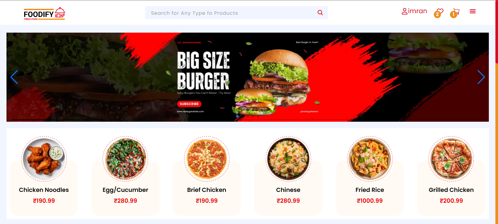

FOODIFY – Modern Food Delivery Web App

TastyExpress is a fully responsive food delivery platform built using React, Redux Toolkit, and external CSS, offering a seamless and intuitive user experience across all devices. Designed with performance and scalability in mind, it allows users to effortlessly explore dishes, manage orders, and enjoy a smooth checkout flow.

Why TastyExpress?
🍽️ Intuitive UI – Clean and modern interface for effortless food discovery

⚛️ Powered by React + Redux Toolkit – Efficient state management and scalable architecture

📱 Responsive Design – Optimized layout for mobile, tablet, and desktop screens

🚀 Fast & Lightweight – Built for performance with modular, reusable components

🎨 Custom Styling – External CSS for fine-grained visual control and polished aesthetics

🛒 Core Features – Browse menus, view dish details, add to cart, and complete orders with ease

